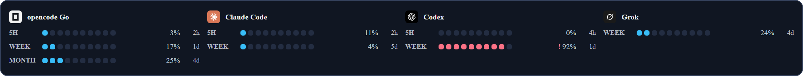

# Manapoint
[English version](README-en.md)

> 作為一個擁有超能力的 Agentic 工程師，魔力就是你的超能力根源，你需要隨時掌控好他們。


五家 AI 訂閱的用量，一個懸浮小面板全看到。

Manapoint 是基於 Rust + Tauri 2 開發的桌面小工具，常駐顯示 opencode Go、Claude Code、Codex、Grok、Antigravity
的用量窗口（5 小時 / 每週 / 每月），右鍵可重新整理、開設定、結束。

## 下載

到 [Releases](https://github.com/vux427/Manapoint/releases) 抓 `Manapoint.exe`，放哪都行，
雙擊就跑——不用安裝、不用管理員權限、不必先裝 .NET 或 Node。

Windows 11 已內建需要的 WebView2 執行階段；Windows 10 若還沒有，第一次執行會提示安裝。

想改東西才需要整包 clone，見下面的建置與測試。

### 被防毒軟體攔下來的話

`Manapoint.exe` 還沒有付費的程式碼簽章憑證。Windows Defender 與 SmartScreen 對沒簽章、
又剛發布沒什麼下載量的執行檔本來就會警告，有時直接判定成病毒——那是誤判。要確認手上的檔案
沒被動過，跟 Releases 頁面列的 SHA-256 對一下：

```powershell
Get-FileHash .\Manapoint.exe -Algorithm SHA256
```

Manapoint 只讀各家 CLI 已經存在本機的登入狀態，並對各家官方 API 發請求，取數邏輯全在
`src-tauri/src/providers/`，原始碼都在這個 repo 裡。仍然被攔的話可以到
[微軟誤判回報](https://www.microsoft.com/en-us/wdsi/filesubmission)提交檔案，通常幾天內解除。

## 風格一覽

| 石墨 | 魔力 |
|---|---|
|  |  |

| 終端 | 紙白 |
|---|---|
|  |  |

| 精簡 |
|---|
|  |

### 橫向排列

精簡風格橫向時把各家壓成一列：


其他風格橫向時每家一欄，標題在上：




## 特色

- 只讀本機各家 CLI 既有的登入狀態，不要求 API key；token 過期自動換發，不寫出憑證
- 五種面板風格：石墨、魔力、終端、精簡、紙白
- 直向、橫向兩種排列，每種風格都有各自的橫向版面（精簡風格橫向時擠成一列）
- 訂閱顯示順序可在設定頁拖曳調整（有插入線指示）
- 拖曳時即時磁吸螢幕邊緣與四角，離開門檻就放手，不影響手感
- 取數失敗時顯示原因並保留上次數字，不靜默隱藏
- 右鍵選單可最小化到托盤；可設定開機自動啟動

## 建置與測試

```sh
# Rust 端（取數、視窗、吸附）
cd manapoint-tauri/src-tauri
cargo test
cargo run                 # 開發模式直接啟動
cargo build --release     # 產出精簡執行檔

# 前端端（主題對比與呈現規則）
cd ../..
node --test manapoint-tauri/ui/*.test.mjs
```

發布版執行檔約 4.7 MB（LTO、opt-level=z、剝除符號），靠系統的 WebView2 算繪，
不夾帶執行階段。

### 發布

`scripts/release.ps1` 會建置、簽章（設好憑證時）、把執行檔放到 `dist/Manapoint.exe`，
並印出 SHA-256 給發布說明用。版本資源少了發行者或版權字串就直接失敗，沒簽章時會出警告——
沒簽章的執行檔幾乎一定會被 Defender 攔，所以不讓它安靜地過。

```powershell
# 例：Azure Trusted Signing，{} 會換成要簽的檔案
$env:MANAPOINT_SIGN_CMD = 'signtool sign /v /fd SHA256 /tr http://timestamp.acs.microsoft.com /td SHA256 /dlib "C:\ats\Azure.CodeSigning.Dlib.dll" /dmdf "C:\ats\metadata.json" "{}"'
pwsh -File scripts
elease.ps1
```

需要 Rust 1.82+ 與 Node 18+（Node 只用來跑測試，介面本身沒有任何 npm 依賴）。
Windows 另需 WebView2 執行階段，Windows 11 已內建。

## 架構

```
manapoint-tauri/
  CONTRACT.md          前後端合約：命令、事件、DOM 結構、版面規則
  ui/                  原生 HTML/CSS/ES module，沒有打包步驟
  src-tauri/src/
    providers/         各家的取數與解析，純函式好測
    snap.rs            邊緣吸附的純幾何
    win.rs             Win32：工作區查詢、拖曳中即時吸附
    lib.rs             視窗、托盤、指令、輪詢
```

## 文件

- [Provider 取數對照表](docs/providers.md)：各家 endpoint、憑證位置、窗口定義
- [前後端合約](manapoint-tauri/CONTRACT.md)：型別、指令、版面規則
