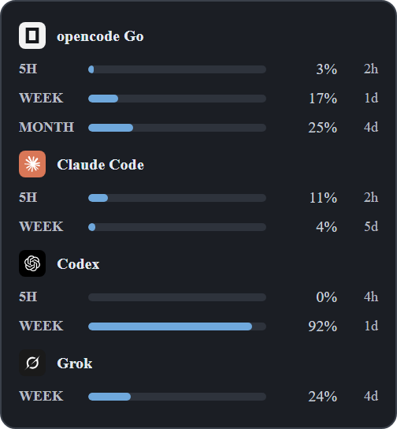
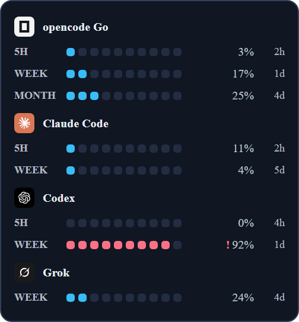
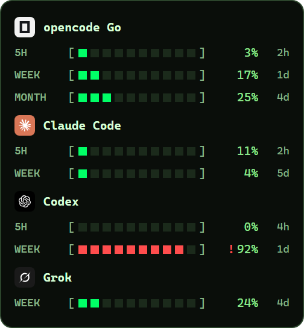
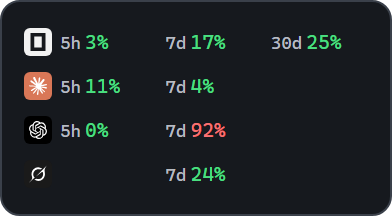
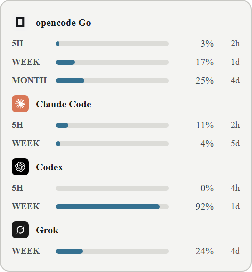

# Manapoint
[English version](README-en.md)

> 作為一個擁有超能力的 Agentic 工程師，魔力就是你的超能力根源，你需要隨時掌控好他們。


四家 AI 訂閱的用量，一個懸浮小面板全看到。

Manapoint 是基於 Rust + Tauri 2 開發的桌面小工具，常駐顯示 opencode Go、Claude Code、Codex、Grok
的用量窗口（5 小時 / 每週 / 每月），右鍵可重新整理、開設定、結束。

## 風格一覽

| 石墨 | 魔力 |
|---|---|
|  |  |

| 終端 | 精簡 |
|---|---|
|  |  |

| 紙白 |
|---|
|  |

## 特色

- 只讀本機各家 CLI 既有的登入狀態，不要求 API key；token 過期自動換發，不寫出憑證
- 五種面板風格：石墨、魔力、終端、精簡、紙白
- 直向、橫向兩種排列，每種風格都有各自的橫向版面（精簡風格橫向時擠成一列）
- 訂閱顯示順序可在設定頁拖曳調整（有插入線指示）
- 拖曳時即時磁吸螢幕邊緣與四角，離開門檻就放手，不影響手感
- 取數失敗時顯示原因並保留上次數字，不靜默隱藏
- 右鍵選單可最小化到托盤；可設定開機自動啟動

## 建置與測試

```sh
# Rust 端（取數、視窗、吸附）
cd manapoint-tauri/src-tauri
cargo test
cargo run                 # 開發模式直接啟動
cargo build --release     # 產出精簡執行檔

# 前端端（主題對比與呈現規則）
cd ../..
node --test manapoint-tauri/ui/*.test.mjs
```

需要 Rust 1.82+ 與 Node 18+（Node 只用來跑測試，介面本身沒有任何 npm 依賴）。
Windows 另需 WebView2 執行階段，Windows 11 已內建。

## 架構

```
manapoint-tauri/
  CONTRACT.md          前後端合約：命令、事件、DOM 結構、版面規則
  ui/                  原生 HTML/CSS/ES module，沒有打包步驟
  src-tauri/src/
    providers/         四家的取數與解析，純函式好測
    snap.rs            邊緣吸附的純幾何
    win.rs             Win32：工作區查詢、拖曳中即時吸附
    lib.rs             視窗、托盤、指令、輪詢
```

## 文件

- [Provider 取數對照表](docs/providers.md)：各家 endpoint、憑證位置、窗口定義
- [前後端合約](manapoint-tauri/CONTRACT.md)：型別、指令、版面規則
