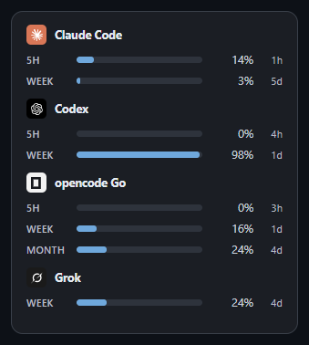
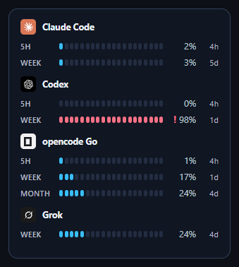
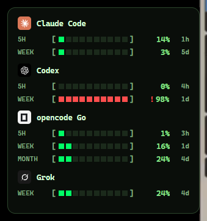
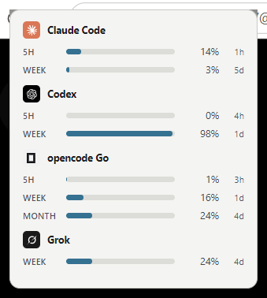
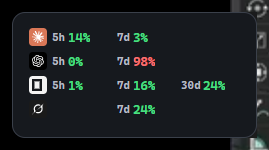
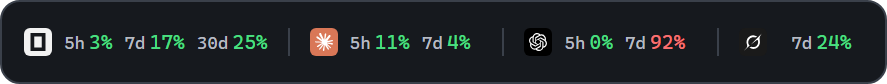
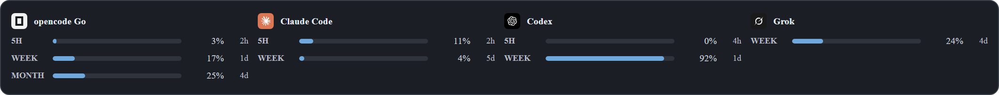
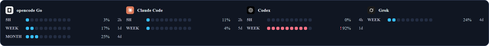

# Manapoint
[English version](README-en.md)

> 作為一個擁有超能力的 Agentic 工程師，魔力就是你的超能力根源，你需要隨時掌控好他們。


五家 AI 訂閱的用量，一個懸浮小面板全看到。

Manapoint 是用 [tinyjs](https://tinyjs.app) 寫的桌面小工具（前後端都是 JavaScript），常駐顯示
opencode Go、Claude Code、Codex、Grok、Antigravity 的用量窗口（5 小時 / 每週 / 每月），
右鍵可重新整理、開設定、結束。

## 下載

到 [Releases](https://github.com/vux427/Manapoint/releases) 抓 `Manapoint-<版本>-win.zip`，
解壓到哪都行，雙擊裡面的 `Manapoint.exe` 就跑——不用安裝、不用管理員權限、不必先裝 .NET 或 Node。
同資料夾的 `launcher.exe` 是負責視窗的那一半，兩個檔案要放在一起。

Windows 11 已內建需要的 WebView2 執行階段；Windows 10 若還沒有，第一次執行會提示安裝。

想改東西才需要整包 clone，見下面的建置與測試。

### 被防毒軟體攔下來的話

Manapoint 還沒有付費的程式碼簽章憑證。Windows Defender 與 SmartScreen 對沒簽章、
又剛發布沒什麼下載量的執行檔本來就會警告，有時直接判定成病毒——那是誤判。要確認手上的檔案
沒被動過，跟 Releases 頁面列的 SHA-256 對一下：

```powershell
Get-FileHash .\Manapoint-0.3.1-win.zip -Algorithm SHA256
```

Manapoint 只讀各家 CLI 已經存在本機的登入狀態，並對各家官方 API 發請求，取數邏輯全在
`manapoint/src/providers/`，原始碼都在這個 repo 裡。仍然被攔的話可以到
[微軟誤判回報](https://www.microsoft.com/en-us/wdsi/filesubmission)提交檔案，通常幾天內解除。

## 風格一覽

| 石墨 | 魔力 |
|---|---|
|  |  |

| 終端 | 紙白 |
|---|---|
|  |  |

| 精簡 |
|---|
|  |

### 橫向排列

精簡風格橫向時把各家壓成一列：



其他風格橫向時每家一欄，標題在上：





## 特色

- 只讀本機各家 CLI 既有的登入狀態，不要求 API key；token 過期自動換發，不寫出憑證
- 五種面板風格：石墨、魔力、終端、精簡、紙白
- 直向、橫向兩種排列，每種風格都有各自的橫向版面（精簡風格橫向時擠成一列）
- 訂閱顯示順序可在設定頁拖曳調整（有插入線指示）
- 拖曳時即時磁吸螢幕邊緣與四角，離開門檻就放手，不影響手感
- 多途徑取數：每家都會嘗試所有找得到的登入（自家 CLI、opencode 代存的登入含 console 登入、
  多帳號外掛），任一條成功就顯示，全部失敗才報錯；不同帳號各畫一組 bar
- 取數失敗時顯示原因並保留上次數字，不靜默隱藏
- 右鍵選單可最小化到托盤；可設定開機自動啟動

## 建置與測試

先裝 tinyjs 0.42 以上（`irm https://tinyjs.app/install.ps1 | iex`）與 Node 18+
（Node 只用來跑測試，程式本身沒有任何 npm 依賴）。

```sh
cd manapoint
node --test test/*.test.mjs   # 取數解析、token 規則、吸附幾何、主題對比
tinyjs dev                    # 開發模式，改前端即時生效
tinyjs build                  # 產出 dist/Manapoint.exe + dist/launcher.exe
```

發布版合計約 6.7 MB（txiki.js 執行環境 5.8 MB + WebView2 視窗啟動器 0.9 MB），
靠系統的 WebView2 算繪。

卡片顯示錯誤時，可以跑診斷腳本看原因。它只印出檔案是否存在、欄位名稱、到期時間與錯誤訊息，
不會印出任何 token，可以直接貼到 issue：

```powershell
cd manapoint
& "$env:LOCALAPPDATA\tinyjs\bin\tjs.exe" run diagnose.js
```

### 發布

`scripts/release.ps1` 會跑測試、建置、簽章 `launcher.exe`（設好憑證時）、把兩個執行檔打包成
`dist/Manapoint-<版本>-win.zip`，並印出 SHA-256 給發布說明用。沒簽章時會出警告——
沒簽章的執行檔幾乎一定會被 Defender 攔，所以不讓它安靜地過。

```powershell
# 例：Azure Trusted Signing，{} 會換成要簽的檔案
$env:MANAPOINT_SIGN_CMD = 'signtool sign /v /fd SHA256 /tr http://timestamp.acs.microsoft.com /td SHA256 /dlib "C:\ats\Azure.CodeSigning.Dlib.dll" /dmdf "C:\ats\metadata.json" "{}"'
pwsh -File scripts\release.ps1
```

## 架構

```
manapoint/
  tinyjs.json          視窗外觀（無邊框、透明、常駐托盤型）與版本
  CONTRACT.md          前後端合約：API、事件、DOM 結構、版面規則
  diagnose.js          診斷腳本（不印任何祕密）
  src/
    main.js            後端入口：API、設定、快取、每 5 分鐘輪詢
    providers/         各家的取數、解析與 token 換發，純函式好測
    lib/               共用：錯誤分類、檔案/網路 IO、Windows 憑證管理員（FFI）
    frontend/          面板與設定頁；panel.js 也負責視窗幾何、拖曳吸附、托盤、右鍵選單
  test/                node --test 測試
```

## 文件

- [Provider 取數對照表](docs/providers.md)：各家 endpoint、憑證位置、窗口定義
- [前後端合約](manapoint/CONTRACT.md)：型別、API、版面規則
